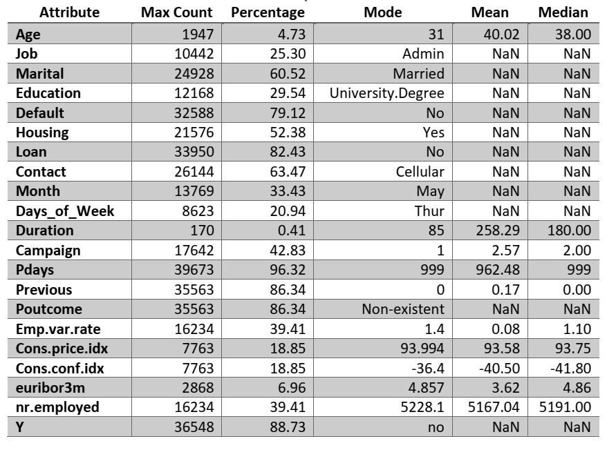
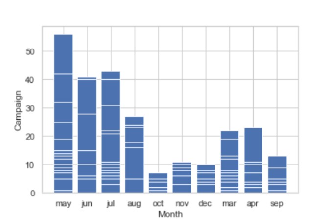
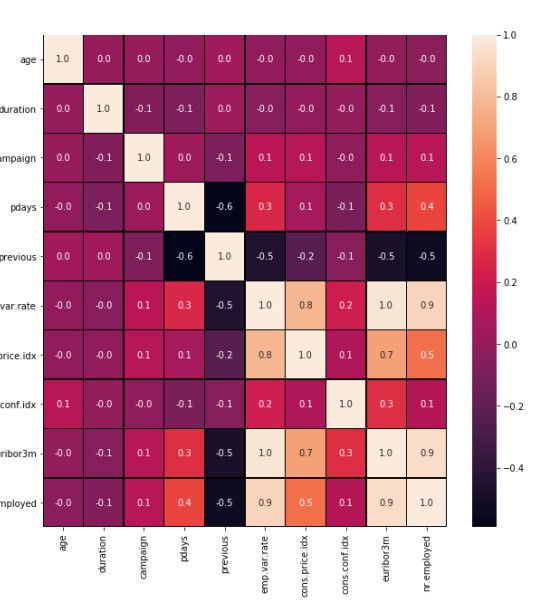

# Data Analysis of Bank Marketing Campaign Dataset
In this analysis, we are required to perform some quantitative analysis tasks Bank Marketing Campaign Dataset. This will involve performing appropriate screening, cleaning, and formatting of the dataset, as well as the presentation of relevant graphical and statistical details that will aid the interpretation of the dataset.
We present below the structure of the rest of this report presentation with a description of each
of the sections.

# Table of Content
- [Data Analysis of Bank Marketing Campaign Dataset](#data-analysis-of-bank-marketing-campaign-dataset)
- [Table of Content](#table-of-content)
- [Data Description](#data-description)
- [Libraries used](#libraries-used)
- [Statistical Analysis](#statistical-analysis)
- [Which of the attributes correlate?](#which-of-the-attributes-correlate)
- [Model Design and evaluation](#model-design-and-evaluation)
- [conclusion](#conclusion)
   
# Data Description
The dataset used for this analysis is the Bank Marketing Campaigns dataset. The actual source of the data is the version of the dataset available from the Kaggle website. The dataset was originally collected from a Portuguese bank that generated it from their directed marketing campaigns between May 2008 and November 2010 to boost the term deposits of bank customers.

The dataset contains 41188 rows (instances) and 21 columns (attributes or features). The first 20 features are the input variables while the last feature was the target variable y – holding a binary value of “Yes” or “No” – which indicates whether the client subscribed to a term deposit, or not. There are no missing values in the dataset. Four categories of input attributes in the
version of the data we used are:
• bank client data (age, job, marital, education, default, housing, and loan).
• last campaign contact data (contact, month, day_of_week and duration).
• other attributes (campaign, pdays, previous and poutcome) and
• socio-economic context attributes (emp.var.rate, cons.conf.idx, euribor3m and nr.employed)

# Libraries used 
This implementation of this analysis used Python programming language and its supporting libraries specifically Pandas, Numpy, Matplotlib and Scikit-learn . The IPython Jupyter notebook was the programming environment used for this work due to its interactive features. Using Jupyter notebook enables ease of documentation and
visualisation.

# Statistical Analysis
The focus of the analysis of this dataset is to gain more insight about the distribution of the key variables as well as understand the impact of the key variable on the target variable. In addition, it will be interesting to see if and how the different variables correlate. To achieve this, we will employ the following descriptive statistical techniques in addressing the following questions:
1. What are mean, median and mode values for the numeric variables?
• Calculate and interpret the measures of central tendencies.
2. How did combinations of attributes interact in deciding whether to subscribe or not?
• Plot and interpret distributions of categorical variables.
3. Which of the attributes correlate?
• Investigate which of the independent variables are correlated and to what extent.
4. How do the attributes affect the target variable, y?
• Measure the impact of the independent the variables on the target variable, y.
Due to space constraints, we use only selected attributes in addressing each of the research questions.

Descriptive statistics are the numerical and graphical techniques used to organise, present, and analyse data. One way to gain insight into data values is by computing the standard measures of central tendency – mean, median and mode is shown in the table below

A quick look at the Table 2 provides the following insight about the entries:
• 36548 (i.e., 88.73%) of the customers called did not subscribe to term deposit.
• The age range of the customer was between 17 and 98 years old with 31 years as the most frequent age.
• Nearly a third of all customers have university degrees while about 25% were in some sort of admin role.
• Two thirds of them were married.
• A third of all calls were made in the month of May while about 21% of the calls happened on a Thursday.
.On average a call lasts for approximately 4mins (258 seconds) with majority of calls barely going beyond a minute (85 secs)

If we consider the number of contacts that happened per month, it can be confirms that most contacts were made
in the month of May, followed by July and then in June acoording to the chart below

 The least months with
contact where October, December, and
November, respectively.
It is also clear from the plot that, on
average, more contacts happened in the
surrounding months (April, June, July,
and August) than in the other months.
Day_of_Week versus campaign
Again, Figure 5 indicates that the most
campaigns happened on Monday. This is
followed by Thursday, Friday, and Wednesday
respectively. The least was on Tuesday. This
will seem contradictory to what Table 2
(Descriptive Statistics) shows.
However, we need to remember that this plot
is done on only 10% of the entire dataset.
Although this is balanced subsample of the
dataset based on the target variable, it did not consider other distributions e.g.,day_of_week.
 Bar plot of Campaign and Month

 # Which of the attributes correlate?

 
The correlation plot clearly indicates that the pairs
of attributes from the five socio-economic
context variables employee variation rate,
consumer price index, consumer confidence
index, euribor 3 month rate and number of
employees do strongly correlate. This is not
surprising as they are specific daily, monthly,
or quarterly indicators independent of the
customer’s circumstances.
Other attribute pairs have zero or less
correlation values.

# Model Design and evaluation
The model building and evaluation process is described with the following process
• The categorical data was converted into numerical data for training the dataset 
• The target feature is assigned to variable and other features are also assigned to a variable name
• The dataset is divided into training and testing data. 80% of the dataset was use for training the model while 20% of the dataset
     was use or testing the model
• Support vector machine algorithm is used with the data since it is a classification problem
• The model is the evaluated with score function to check the accuracy level of the model. The
model produces 89% accuracy on test data

# conclusion
This is a classification algorithm analysis and the only algorithm that was used on the dataset was Support vector machine (SVM) which perform considerable well on the dataset. other classification algorithm can be performed and their performance can be compared.